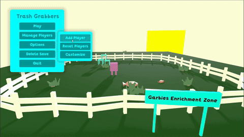
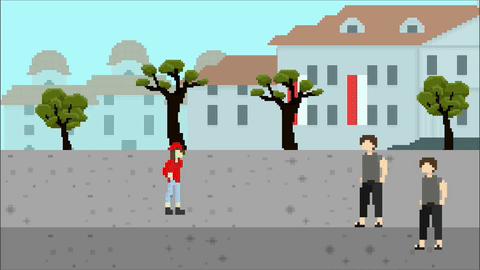

<h1>Greetings 👋</h1>
<ul>
  <li>Hello there! My name is Ruby.</li>
  <li>I am currently a Bina Nusantara University student majoring in Game Application and Technology in the department of Computer Science.</li>
  <li>I can program in several languages: C, C#, Python, and GDScript.</li>
  <li>You can contact me via e-mail (rubyrebyru@gmail.com) or Whatsapp (081513080678).</li>
</ul>
<h1>My Game Projects 🎮</h1>

  <table>
    <tr>
      <td width="50%" valign="top">
        <h2 align="center">Trash Grabbers</h2>
        

          </img>
          
Trash Grabbers is a game where players work cooperatively as trash grabbers in a corporation creatively named The Corporation. Players must use wits (and corporate tools) to finish their job quickly and efficiently!

        

      </td>
      <td width="50%" valign="top">
        <h2 align="center">Not Ready</h2>
        

          </img>
          
Not Ready is a 3D FPS game that’s intended to be the low-poly version of Ready or Not.

        

      </td>
    <tr>
      <td width="50%" valign="top">
        
See project <a href="https://github.com/bibyru/Little-Grabbers/">here</a>.

        
Download <a href="https://github.com/bibyru/Little-Grabbers/releases/">here</a>.

      </td>
      <td width="50%" valign="top">
        
See project <a href="https://github.com/bibyru/Not-Ready/">here</a>.

        
Download <a href="https://github.com/bibyru/Not-Ready/releases/">here</a>.

      </td>
    </tr>
    <tr>
      <td width="50%" valign="top">
        <h2 align="center">Knightly Pong</h2>
        

          </img>
          
Knightly Pong is a pong game with 2 players where they hit each other’s castle to gain points.

        

      </td>
      <td width="50%" valign="top">
        <h2 align="center">Map Me!</h2>
        

          </img>
          
Map Me! is a 2D point and click serious game. Map Me!, as a serious game, has the goal of promoting Indonesian tourist destinations. Players click at dots on one of the Indonesian islands to locate the tourist destination.

        

      </td>
    </tr>
      <td width="50%" valign="top">
        
See project <a href="https://github.com/bibyru/Knightly-Pong/">here</a>.

        
Download <a href="https://github.com/bibyru/Knightly-Pong/releases/">here</a>.

      </td>
      <td width="50%" valign="top">
        
See project <a href="https://github.com/bibyru/map-me/">here</a>.

        
Download <a href="https://drive.google.com/file/d/1B9J-vQRz8U3bqxgLN-w2LG2SSQwbhPXB/view?usp=drive_link">here</a>.

      </td>
    </tr>
    <tr>
      <td width="50%" valign="top">
        <h2 align="center">Puzzlegenic Beatings</h2>
        

          </img>
          
Puzzlegenic Beatings is a 2D beat-em-up puzzle serious game. Follow Pam’s story as she finds a mysterious but labeled puzzle bag… WITHOUT A PICTURE! How will she even start to finish the puzzle?! And so, she goes to the place with the same name as the puzzle. Play as Pam as she beats up thugs at the tourist destination messing the place up, then finishes the puzzle.

        

      </td>
      <td width="50%" valign="top">
        <h2 align="center">Fruit Hunter</h2>
        

          </img>
          
Fruit Hunter is a 2D platformer. Players must have ultimate control of the character and take advantage of every single platform to optimize time and amount of fruits taken.

        

      </td>
    </tr>
      <td width="50%" valign="top">
        
See project <a href="https://github.com/bibyru/Puzzlegenic-Beatings/">here</a>.

        
Download <a href="https://drive.google.com/file/d/1YzoLHeXPfgZBqnKLEwyi3CKiMjcV_ZuE/view?usp=drive_link">here</a>.

      </td>
      <td width="50%" valign="top">
        
See project <a href="https://github.com/bibyru/Fruit-Hunter/">here</a>.

        
Download <a href="https://drive.google.com/file/d/19ChyNNeD2Bx9-849sNL_KdqG6j2dKO1x/view?usp=drive_link">here</a>.

      </td>
    </tr>
  </table>

<!--
**bibyru/bibyru** is a ✨ _special_ ✨ repository because its `README.md` (this file) appears on your GitHub profile.

Here are some ideas to get you started:

- 🔭 I’m currently working on ...
- 🌱 I’m currently learning ...
- 👯 I’m looking to collaborate on ...
- 🤔 I’m looking for help with ...
- 💬 Ask me about ...
- 📫 How to reach me: ...
- 😄 Pronouns: ...
- ⚡ Fun fact: ...
-->
